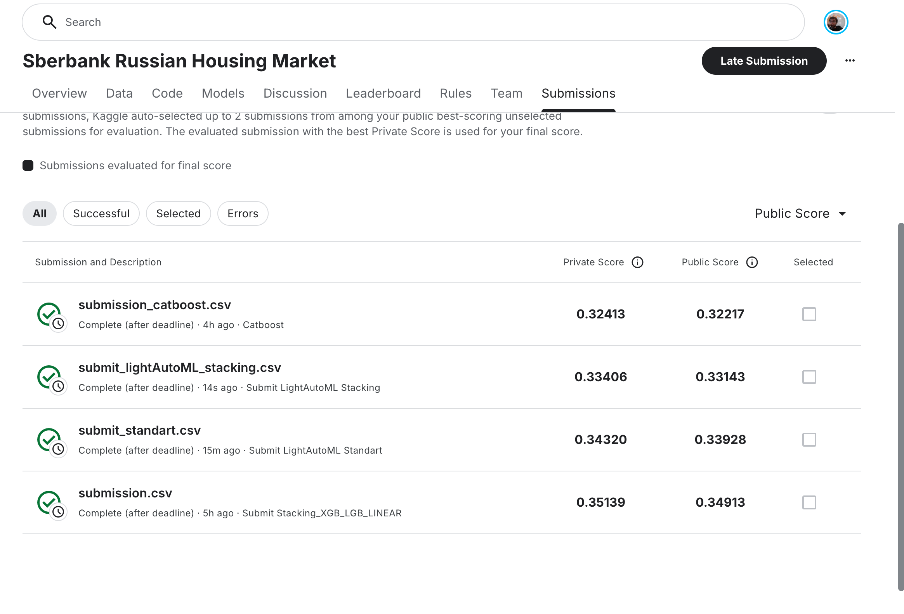

# Sberbank Russian Housing Market

[Соревнование](https://www.kaggle.com/competitions/sberbank-russian-housing-market/overview)

## Цель
Разработать наиболее точные модели прогнозирования стоимости недвижимости, учитывающие сложные взаимосвязи между характеристиками жилья и макроэкономическими факторами, для поддержки клиентов банка в планировании бюджетов и снижении рисков.

Основные задачи:
- Провести качественный EDA
- Превзойти бейзлайн на LightAutoML (LAMA)
- Реализовать воспроизводимый, чистый и структурированный код
- Применить современные методы препроцессинга, feature engineering и ансамблирования

## Основные результаты

| Участник | Результат | Отставание от лидера |
| :--- | :--- | :--- |
| **🥇 1. CatBoost (Manual)** | **0.4076** | – |
| **🥈 2. Stacking Regressor (XGB + LGBM + Linear)** | 0.4148 | +0.0072 |
| **🥉 3. LAMA Baseline (Stacking)** | 0.4202 | +0.0126 |
| **4. LAMA Baseline (Standard)** | 0.42633 | +0.01873 |

## Основные этапы работы

### 1. **Анализ признаков**

* Был проведен полный разбор типов признаков:

  * Непрерывные числовые: **213**
  * Целые числа: **157**
  * Категориальные: **18**
  * Дата/время: **1**
* Выделил **числовые категориальные** признаки (≤20 уникальных) — **105** шт.; вместе с явными категориальными это даёт **≈123 категориальных** и **≈266 непрерывных** признаков.
* Проанализировал пропуски: **94 из 389** признаков содержат пропуски, часть признаков имеет долю NaN > 50% — такие признаки я пометил как неинформативные и удалил в рамках правила (удалять при >50% пропусков).
* Исследовал мультиколлинеарность: обнаружил ≈**390 пар** с корреляцией ≥ 0.99. Для снижения влияния мультиколлинеарности я применил агрегацию и PCA для сильно коррелированных групп и сделал упор на модели-деревья, менее чувствительные к мультиколлинеарности.
* Выделил признаки с заметной связью с таргетом: `num_room` и `full_sq`. Для большинства признаков связь с `price_doc` оказалась **нелинейной**, поэтому в основном использовал нелинейные модели (градиентный бустинг, ансамбли).

---

### 2. **Обработка категориальных признаков**

* Для бинарных признаков (yes/no, owner/investment) сделал **binary encoding (0/1)**.
* Для `ecology` применил **ordinal encoding** (порядок: poor < satisfactory < good < excellent).
* Для `sub_area` было реализовано кодирование **target encoding**.
* Числовые признаки, представленные как строки (`child_on_acc_pre_school`, `modern_education_share`, `old_education_build_share`) — преобразовал в float и масштабировал.

---

### 3. **Работа с пропусками**

* Были удалены признаки с долей NaN > 50% (по правилу отбрасывания неинформативных колонок).
* Реализовал и применил стратегию заполнения:

  * **Числовые** — медиана по группе (`year` + `sub_area`), затем глобальная медиана при отсутствии группы.
  * **Категориальные** — мода по сегментам (район, тип квартиры, год и т.д.).
* Был создан признак **`nan_count`**, отражающую полноту описания объекта (по гипотезе, менее дорогие объекты имеют более неполные записи).

---

### 4. **Feature Engineering**

Были проведены работы по созданию новых признаков на основе существующих:

* **`living_area_ratio`** — отношение жилой площади к полной площади (`life_sq / full_sq`).
  *Смысл:* показывает, какая часть площади действительно жилой; низкое значение может означать большую долю подсобных/нежилых помещений и снижать стоимость.

* **`floor_ratio`** — доля этажа относительно количества этажей в доме (`floor / max_floor`).
  *Смысл:* нормализует положение квартиры по этажу между домами с разной этажностью; учитывает эффект верхних/нижних этажей на цену.

* **`rooms_per_total_sq`** — плотность планировки (`num_room / full_sq`).
  *Смысл:* показывает соотношение комнат к площади; много комнат при малой площади указывает на маленькие комнаты и может снижать привлекательность.

* **`amenities_per_1k_pop`** — количество ключевых объектов инфраструктуры (кафе, ТЦ, офисы, спортивные объекты) на 1000 жителей района.
  *Смысл:* измеряет плотность инфраструктуры; высокая плотность обычно повышает удобство жизни и стоимость жилья.

* Дополнительно: **агрегаты по району** (средняя цена, медиана площади, доля однотипных объектов), а также PCA-компоненты для наборов сильно коррелированных числовых признаков.

---

### 5. **Кодирование и кастомные трансформеры**

Был написан набор `sklearn`-совместимых трансформеров, чтобы пайплайн был воспроизводимым и безопасным для transform на test:

* **BinaryEncoder** — бинаризация yes/no.
* **SklearnTargetEncoder** — target encoding.
* **OrdEncoder** — порядковое кодирование (`ecology`).
* **StringNumericConverter** — перевод строковых чисел в `float`.
* **Scaler** — обёртка над `StandardScaler`, сохраняющая имена колонок и устойчиво работающая при отсутствии колонок.
* **GroupImputer** — заполнение пропусков медианами внутри групп (year + sub_area) с fallback на глобальную медиану.
* **CorrelatedGroup** — нахождение сильно коррелированных пар и замена группы коррелированных признаков на PCA-компоненты.

---

### 6. **Моделирование**

* Реализовано несколько подходов:

  1. LightAutoML (разные конфигурации).
  2. CatBoost (работает с категориальными признаками напрямую).
  3. **Stacking (XGB + LGBM + Linear)**.

---

## Выводы

- Цель достигнута: кастомное решение — CatBoost — превзошел LightAutoML с лучшей кофигурацией.

- Качественный EDA позволил выявить ключевые закономерности и сформулировать рабочие гипотезы (влияние sub_area, связь num_room и full_sq с ценой, отрицательная корреляция количества NaN с price_doc).

- Созданы информативные признаки, которые улучшили сигнал модели: living_area_ratio, floor_ratio, rooms_per_total_sq, amenities_per_1k_pop, nan_count, PCA-компоненты для сильно коррелированных групп.

- Использование pipeline и кастомных трансформеров (BinaryEncoder, SklearnTargetEncoder, GroupImputer, Scaler, CorrelatedGroup и др.) обеспечило чистоту, воспроизводимость и безопасное применение к тестовым данным.

- Итоговое улучшение относительно лучшего показателя LightAutoML: ≈ 0.02 RMSLE, что подтверждает, что основное качество добавила ручная обработка данных.

